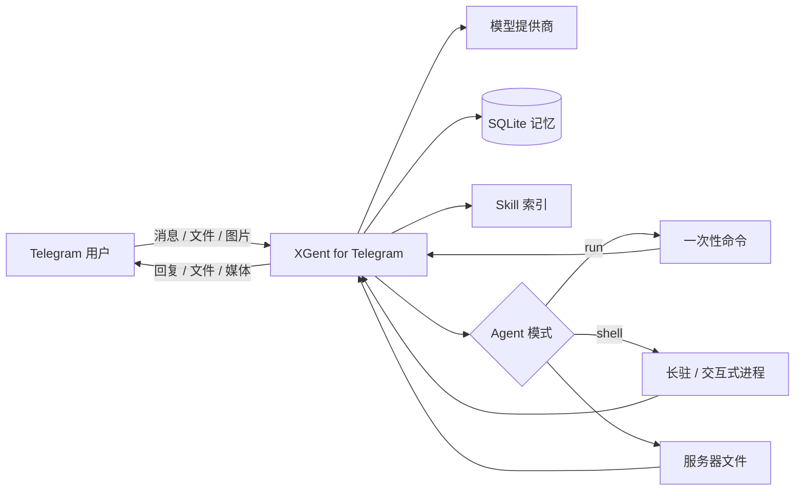

# XGent for Telegram

<p align="center">
  <strong>把你的 Linux 服务器装进 Telegram。</strong>
</p>

<p align="center">
  一个部署在自己服务器上的私有 AI Agent：不仅能聊天，还能执行命令、处理文件、管理长驻任务，并通过 Skill 扩展能力。
</p>

<p align="center">
  <a href="https://github.com/HANLINGVABCN/xgent-telegram/actions/workflows/tests.yml"></a>
  <a href="https://github.com/HANLINGVABCN/xgent-telegram/blob/main/LICENSE"></a>
  
  
</p>

> [!IMPORTANT]
> 本项目面向**单用户私有部署**。Agent 模式能够在服务器上执行真实命令，不是完整沙箱；请先阅读[安全说明](#安全说明)，并使用独立的低权限账号运行。

> [!NOTE]
> **本仓库（`xgent-telegram-test`）是发布仓库 `xgent-telegram` 的测试副本。**
> 下面的徽章、克隆命令和默认更新源都指向发布仓库，这是有意为之。
> `/update` 会先弹菜单让你选更新源（正常更新 = 发布仓库，测试更新 = 本仓库），
> 不会自动跨仓覆盖。在本仓库做的改动需要同步到发布仓库才会进入正式发布。

## 它能做什么

| 场景 | 你可以直接在 Telegram 里说 |
| --- | --- |
| 服务器排障 | “检查磁盘为什么快满了，找出最大的文件并给我一份报告。” |
| 文件处理 | “找到今天生成的备份，压缩后直接发给我。” |
| 长驻任务 | “启动这个服务，持续观察日志，遇到异常时告诉我。” |
| 私人助理 | “结合之前的对话和这份文件，整理一份执行清单。” |
| 媒体生成 | “用默认媒体模型生成一张封面图并发给我。” |
| 自定义能力 | 通过 `skill/` 增加工作流；私有 skill 放 `skill/private/`，每个可单独启用/禁用。 |

### 典型交互（示意）

```text
你：检查服务器状态，重点看看磁盘和内存，再把完整报告发给我。

AI：我会先采集系统状态，然后分析异常项。
    ✓ 执行磁盘检查
    ✓ 执行内存与进程检查
    ✓ 生成诊断报告
    ✓ 已将 report.md 发送到 Telegram

AI：当前主要问题是 /var/log 占用增长过快……
```

这不是一个公开群聊机器人，也不只是把模型 API 接到 Telegram。它更适合把 Telegram 变成你的**私人 AI 控制台**。

## 核心能力

- **真实 Agent 执行**：运行一次性命令，管理交互式或持续输出的 Shell 会话。
- **服务器文件操作**：读取、创建、覆盖和发送服务器文件，命令完整输出自动归档。
- **多模型提供商**：支持 OpenAI、OpenAI 兼容接口、Gemini、Vertex 和 Claude。
- **思考深度控制**：8 档全局思考深度，按提供商自动翻译成 `thinking.budget_tokens`、`thinkingConfig.thinkingBudget`、`reasoning_effort` 或 `reasoning.effort`。
- **网页版聊天**：可选的本地 Web 界面，与 Telegram 共享同一套对话核心、记忆与 Agent 能力，可作为 Telegram Web App 内嵌打开。
- **对话与媒体模型分离**：可分别设置默认聊天模型和默认媒体模型。
- **全局记忆**：使用 SQLite 保存对话、系统操作、按钮操作和 Agent 结果。
- **多模态上下文**：接收文件、图片和贴纸，并按路径索引保存上下文。
- **流式回复**：支持流式与非流式请求，并可在 Telegram 中随时切换。
- **Skill 扩展**：Skill 只按索引进入提示词，需要时再由模型读取具体说明。
- **配置迁移**：提供商、模型和默认选择可导出为 JSON，并在其他实例中合并或覆盖导入。
- **私有访问控制**：只有 `.env` 中指定的 Telegram 用户 ID 可以使用机器人。
- **在线维护**：支持通过 Telegram 更新代码、重启 Bot 和管理常用配置。

## 适合与不适合

**适合你，如果你：**

- 有一台 Linux VPS、家庭服务器或开发机；
- 日常使用 Telegram，希望随时处理服务器任务；
- 已有模型 API Key，并希望数据与运行环境由自己掌控；
- 理解 Shell 权限边界，愿意为 Agent 使用独立低权限账号。

**可能不适合你，如果你：**

- 想要无需服务器、注册即用的托管服务；
- 需要多人共享、公开群聊或完善的租户权限系统；
- 希望 Agent 在强隔离沙箱中执行不受信任的命令。

## 工作方式



## 快速部署

### 准备

- Linux 服务器与可用的 Python 3.10+
  （install.sh 的自动补依赖只支持 Debian/Ubuntu；其它发行版需先手动装好 Python 3.10+、pip、git、curl）
- 从 [BotFather](https://t.me/BotFather) 获取的 Telegram Bot Token
- 你的 Telegram 用户 ID
- 至少一个可用的模型 API Key

### 一键命令

以下命令会将项目安装到 `/opt/xgent-telegram`；可将 `/opt` 换成其他目录。

```bash
cd /opt && sudo git clone https://github.com/HANLINGVABCN/xgent-telegram.git && sudo chown -R "$USER":"$USER" xgent-telegram && cd xgent-telegram && chmod +x install.sh && ./install.sh
```

安装脚本会完成环境检查、虚拟环境创建、依赖安装、`.env` 创建与 Telegram Token 校验，然后让你选择启动方式：

- 前台运行
- 后台运行
- PM2 守护运行
- 仅检查环境

### 分步安装

```bash
cd /opt
sudo git clone https://github.com/HANLINGVABCN/xgent-telegram.git
sudo chown -R "$USER":"$USER" xgent-telegram
cd xgent-telegram
chmod +x install.sh
./install.sh
```

首次安装时，脚本会提示填写：

```env
BOT_TOKEN=你的 Telegram Bot Token
AUTHORIZED_USER_ID=你的 Telegram 用户 ID
```

如果仓库以后改为私有，并希望继续使用 `/update`，可额外配置：

```env
# Fine-grained token 只需要该仓库 Contents: Read-only。
UPDATE_GITHUB_TOKEN=你的 GitHub Token
UPDATE_ZIP_URL=https://api.github.com/repos/HANLINGVABCN/xgent-telegram/zipball/main
```

`UPDATE_ZIP_URL` 可省略，默认使用上面的公开仓库地址。私有仓库没有配置 Token 时，GitHub 会返回 404/403，在线更新将失败。

## 第一次使用

1. 在 Telegram 中向机器人发送 `/start`。
2. 打开「提供商」，添加 API URL、API Key 和模型列表。
3. 打开「默认模型」，选择默认对话模型。
4. 如需媒体生成，再选择默认媒体模型。
5. 确认安全边界后，根据需要开启 Agent 模式。

配置完成后，可以直接发送普通消息、图片或文件，无需使用专门的聊天命令。

## Telegram 命令

| 命令 | 说明 |
| --- | --- |
| `/start` | 打开主菜单 |
| `/config` | 打开配置菜单 |
| `/providers` | 管理提供商与模型列表 |
| `/provider_config` | 导入导出提供商配置 |
| `/models` | 选择默认模型 |
| `/chat_model` | 选择默认对话模型 |
| `/media_model` | 选择默认媒体模型 |
| `/prompts` | 管理提示词 |
| `/clear_memory` | 清空上下文 |
| `/depth` | 设置记忆深度 |
| `/timeout` | 设置请求超时 |
| `/thinking` | 设置思考深度 |
| `/web` | 配置网页版聊天 |
| `/agent` | 开关 Agent 模式 |
| `/blacklist` | 管理 Agent 命令黑名单 |
| `/stream` | 开关流式输出 |
| `/status` | 查看状态 |
| `/show_chat_info` | 查看状态与记忆统计，等同 `/status` |
| `/export` | 导出全部记忆 |
| `/update` | 更新代码并重启 |
| `/restart` | 重启 Bot |

## 提供商配置迁移

在「提供商」菜单中点击「导出配置」可下载 JSON 配置文件；点击「导入配置」后，可发送该 JSON 文件或直接粘贴完整 JSON。

- 导出内容包括提供商 URL、完整 API Key、接口格式、模型列表和默认模型选择。
- **合并导入**：更新同名提供商，保留其他已有提供商。
- **覆盖导入**：删除现有提供商，再按导入文件完整重建。
- 默认模型仅在对应提供商和模型均存在时恢复。

> [!CAUTION]
> 导出的 JSON 包含明文 API Key。不要公开分享，也不要提交到代码仓库。

## Prompt 与 Skill

项目提示词位于 `prompts/`：

- `main.txt`：基础身份提示。
- `global_addon.txt`：运行环境、上下文读取和记忆规则。
- `agent_addon.txt`：Agent 工具协议和执行规则。
- `agent_disabled_addon.txt`：Agent 关闭时的限制说明。

每轮请求按以下顺序拼接系统提示词：

1. 主提示词；
2. 全局附加提示词；
3. Agent 提示词；
4. 当前运行目录、上传目录、命令输出目录等路径信息；
5. `skill/` 文件索引（被禁用的 skill 不计入）；
6. Agent 关闭时的限制说明。

`skill/` 只以索引形式进入提示词，模型需要时才读取具体文件。Skill 文件简介使用 `!` 围栏协议块；同一文件中的多个 `!` 块会按出现顺序合并：

````text
```!
这里写会进入索引的简介；可以写多行。
适合放用途、触发场景和重要边界。
```
````

**Skill 目录与按需启停**：
- 仓库公共 skill 放 `skill/` 根目录；仅本部署实例使用的私有 skill 放 `skill/private/`（被 git 忽略，更新不覆盖）。
- 每个 skill 默认启用。不需要的可在 TG 的 `/skills` 菜单或 web 设置面板「Skill 管理」中关闭，关掉的不进 Prompt。

执行 `/update` 时，可选择保留或覆盖 `prompts/` 提示词。skill 文件随仓库更新，`skill/private/` 私有 skill 永不被覆盖。覆盖前，当前内容会备份到：

```text
xgent_storage/update_backups/custom_时间戳/
```

## Agent 模式

Agent 模式开启后，模型可通过内部协议调用真实工具能力：

- `run`：执行一次性命令并保存完整结果；
- `shell`：管理长驻、持续输出和交互式命令；
- `read`：读取服务器文件；
- `edit`：按精确匹配替换文件中的片段；
- `grep`：在文件或目录中检索内容；
- `file`：创建或覆盖服务器文件；
- `sendfile`：将服务器文件发送到 Telegram；
- `search`：联网检索（需配置 Tavily API Key）；
- `fetch`：抓取指定网页内容；
- 媒体协议：调用默认媒体模型生成内容。

Agent 协议只接受 nonce 相同的 `AGENT_BEGIN` / `AGENT_END` 成对标记。nonce 每块唯一。提示词要求模型使用 10～32 位，解析器接受 6～32 位——中间 4 位是有意留的容错冗余，模型少给几位时协议块仍能正常执行，不要为了"一致"把解析器收紧到 10；协议正文按不透明文本处理，内部 Markdown 或协议示例不会被二次解析。

一次性命令的完整输出保存在：

```text
xgent_storage/command_outputs/
```

命令黑名单位于：

```text
prompts/extras/agent_command_blacklist.txt
```

每行填写一个禁止片段；待执行命令包含该片段时会被拦截。黑名单只能降低风险，不能替代操作系统权限隔离。

## 思考深度

`/thinking` 或「更多设置 → 🧠 思考」可设置全局思考深度，共 8 档：关闭、自动、低、中、高、很高、超高、最高。

发请求时会按当前提供商自动翻译成对应字段：

| 提供商 | 字段 |
| --- | --- |
| Claude | `thinking.budget_tokens`（同时抬高 `max_tokens`，Anthropic 要求前者小于后者） |
| Gemini / Vertex | `generationConfig.thinkingConfig.thinkingBudget` |
| OpenAI 及兼容接口 | `reasoning_effort` |
| OpenRouter | `reasoning.effort` |

默认档位是**自动**，即一个思考字段都不发，完全沿用提供商的默认行为。这是有意的：不支持思考的模型收到未知字段会直接返回 400。

模型拒绝思考参数时，系统会自动去掉参数重发一次，并记住该「提供商 + 模型」组合不再重试；切换档位会清空这份记录。

思考内容不会显示在对话里，也不会写入记忆；思考消耗的 token 仍会计入用量统计行。

## 网页版聊天

`/web` 或 `/start` 里的「🌐 Web」按钮可配置网页版界面。它复用同一套对话核心，Agent 模式、协议执行、记忆与停止按钮的行为和 Telegram 完全一致，两端共享同一份 SQLite 记忆。

网页里可以聊天，并调整思考深度、流式开关、Agent 模式、文字拼接、记忆深度、Agent 轮数、回复超时和对话模型。提供商与 API Key 仍只在 Telegram 中管理。

配置项：

- **开关**：未设置密码时拒绝开启。
- **密码**：以 PBKDF2 哈希存入数据库，聊天记录中只保留占位提示。
- **端口**：默认 `8790`。
- **公开地址**：反向代理的 HTTPS 地址，可选。

> [!IMPORTANT]
> 服务只监听 `127.0.0.1`，不会自行暴露到公网。这个界面能驱动 Agent 在服务器上执行真实命令，请勿直接绑定公网地址；需要远程访问时自行配置反向代理并启用 HTTPS。

Telegram 的内嵌网页按钮只接受 HTTPS 地址，因此：

- 已填公开地址时，按钮为 Web App，在 Telegram 内直接弹出页面；
- 未填时，按钮降级为普通链接，用外部浏览器打开本地地址。

在 Telegram 内打开时会通过 `initData` 签名自动登录，无需输入密码；用浏览器直接访问则需要密码。

## 安全说明

Agent 模式拥有真实服务器权限。建议至少执行以下措施：

1. **使用独立低权限 Linux 用户运行 Bot**，不要直接使用 `root`。
2. **默认关闭 Agent**，确认模型、Prompt 和权限配置后再开启。
3. **限制运行账号可访问的目录和密钥**，不要让它读取无关服务的凭据。
4. **维护命令黑名单**，但不要把黑名单当作完整沙箱。
5. **不要提交敏感文件**：`.env`、数据库、日志和 `xgent_storage/`。
6. **谨慎处理外部内容**：网页、文件和转发消息可能包含提示词注入内容。
7. Token 或 API Key 泄露后，应立即在对应平台撤销并重新生成。
8. **网页版只监听 `127.0.0.1`**：需要远程访问时，用反向代理并启用 HTTPS，设置足够强的密码，不要把服务直接绑到公网地址。

项目当前不是强隔离执行环境。如果你的威胁模型包含恶意用户、不可信模型或高价值服务器，请在容器、虚拟机或专用主机中进一步隔离。

## PM2 重启后列表为空

安装脚本在选择 PM2 守护运行时，会执行 `pm2 startup` 和 `pm2 save`，保存进程列表并配置开机恢复。如果服务器重启后 `pm2 list` 为空，请检查：

- 当前命令是否由安装时的同一 Linux 用户执行；`pm2 list` 与 `sudo pm2 list` 属于不同进程表。
- 手动保存：`pm2 save`。
- 手动恢复：`pm2 resurrect`。
- 重新配置：执行 `pm2 startup` 输出的命令，再运行 `pm2 save`。

## 项目结构

```text
xgent-telegram/
├─ xgent_server.py              # 可执行入口
├─ install.sh                 # 安装、启动、更新与维护脚本
├─ requirements.txt
├─ xgent_app/
│  ├─ bootstrap.py            # 模块加载与完整性检查
│  ├─ web_auth.py             # 网页版认证：密码哈希、会话签名、登录限速
│  ├─ web_bridge.py           # 网页版与对话核心之间的垫片
│  ├─ web_server.py           # 网页版 HTTP / SSE 服务
│  ├─ webui/                  # 网页版前端（单文件，无构建步骤）
│  └─ sections/               # Bot 功能模块
├─ prompts/                   # 系统与 Agent 提示词
├─ skill/                     # Skill 说明及配套脚本（skill/private/ 为私有，不进仓库）
├─ tests/                     # 单元测试
├─ tools/                     # 开发检查工具
└─ docs/
   └─ architecture.md         # 架构与重构说明
```

运行后会自动生成：

- `.env`：Bot Token、授权用户 ID 等环境配置；
- `xgent_memory.db`：SQLite 数据库；
- `xgent_storage/`：上传文件、命令输出、生成媒体和更新备份；
- `xgent_server.log`：服务日志；
- `xgent_output.log`：nohup 后台输出；
- `xgent.pid`：nohup 进程 ID。

## 开发与检查

安装依赖后可直接运行：

```bash
python3 xgent_server.py
```

执行完整性检查和测试：

```bash
python tools/check_split_integrity.py
python -m unittest discover -s tests -v
```

GitHub Actions 会在 Python 3.10、3.11 和 3.12 上执行完整性检查、编译检查、单元测试及 Shell 语法检查。

入口由 `xgent_app/bootstrap.py` 引导，并按清单加载 `xgent_app/sections/` 中的兼容模块。详细职责和后续迁移计划见 [`docs/architecture.md`](docs/architecture.md)。

## 发布维护

- [`v0.1.0` GitHub Release 草稿](docs/release-draft-v0.1.0.md)
- [GitHub 元数据、演示脚本与社区发布文案](docs/launch-kit.md)

## License

本项目基于 [MIT License](LICENSE) 开源。
